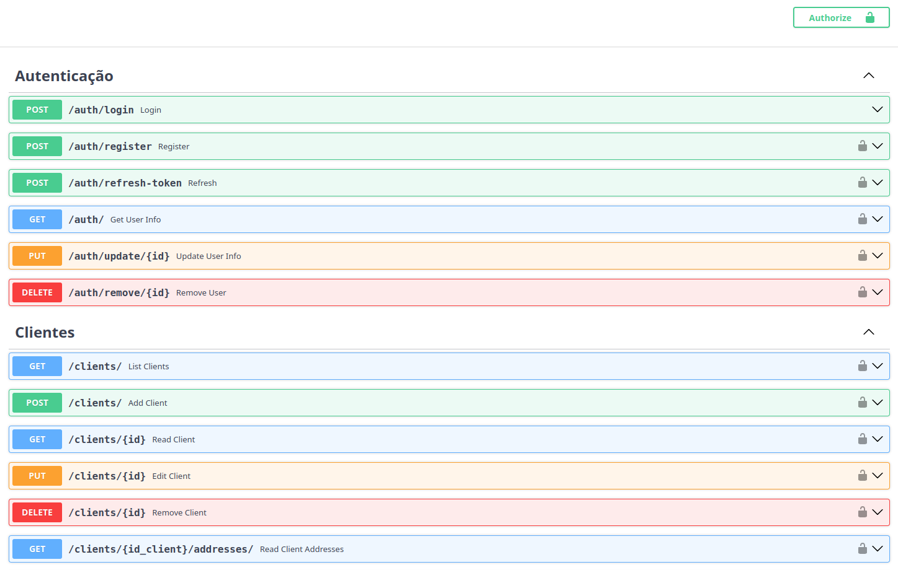

# FastAPI RESTful API

API desenvolvida com FastAPI para gerenciamento de usuários, categorias, clientes, pedidos e produtos, integrada com banco de dados PostgreSQL, com autenticação JWT.

---

---

## Índice

- [Descrição](#descrição)
- [Funcionalidades](#funcionalidades)
- [Tecnologias](#tecnologias)
- [ModeloBanco](#modelobanco)
- [Instalação](#instalação)
- [Configuração](#configuração)
- [Execução](#execução)
- [Endpoints](#endpoints)
- [Docker](#docker)
- [Variáveis de Ambiente](#variáveis-de-ambiente)

---

## Descrição

API RESTful construída com FastAPI que oferece recursos para autenticação (login, registro, refresh token), e gerenciamento de categorias, clientes, endereços, pedidos e produtos.

---

## Funcionalidades

- Autenticação com JWT (login, registro e refresh token)
- CRUD completo para:
  - Categorias de produtos
  - Clientes e seus endereços
  - Pedidos
  - Produtos
- Filtros e paginação em listagens
- Soft delete em categorias (quando associadas a produtos)

---

## Tecnologias

- Python 3.12
- FastAPI 0.115.12
- SQLAlchemy 2.0.41
- PostgreSQL 
- Docker & Docker Compose

---

## ModeloBanco


---
## Instalação

### Pré-requisitos

- Docker
- Docker Compose

### Clone este repositório:

```bash
git clone https://github.com/eduardoSilvaf91/ApiRestFullFastAPI
cd ApiRestFullFastAPI
```

## Configuração

### Configure as variáveis de ambiente no arquivo .env (crie se não existir):

```env
DB_USER=postgres
DB_PASSWORD=postgres
DB_NAME=fastapi_db
```

## Execução
### Para rodar a aplicação usando Docker Compose, execute:

```bash
docker-compose up --build
```
A aplicação estará disponível em http://localhost:8000.


## Endpoints

### Autenticação

- POST /login — Autentica usuário e retorna token JWT
- POST /register — Registra novo usuário
- POST /refresh-token — Atualiza token de acesso

### Categorias

- POST /categories — Cria uma nova categoria
- GET /categories — Lista categorias (com paginação e filtro)
- GET /categories/{id} — Obtém detalhes de uma categoria
- PUT /categories/{id} — Atualiza uma categoria
- DELETE /categories/{id} — Remove uma categoria (soft delete)

### Clientes

- GET /clients — Lista clientes (com filtros e paginação)
- POST /clients — Cria um cliente
- GET /clients/{id} — Detalha um cliente
- PUT /clients/{id} — Atualiza um cliente
- DELETE /clients/{id} — Remove um cliente

### Endereços

- GET /clients/{id_client}/addresses — Lista endereços do cliente
- POST /clients/{id_client}/addresses — Cria endereço para cliente
- PUT /clients/{id_client}/addresses/{address_id} — Atualiza endereço
- DELETE /clients/{id_client}/addresses/{address_id} — Remove endereço

### Pedidos

- GET /orders — Lista pedidos (com filtros e paginação)
- POST /orders — Cria pedido
- GET /orders/{id} — Detalha pedido
- PUT /orders/{id} — Atualiza pedido
- DELETE /orders/{id} — Remove pedido

### Produtos

- GET /products — Lista produtos (com filtros e paginação)
- POST /products — Cria produto
- GET /products/{id} — Detalha produto
- PUT /products/{id} — Atualiza produto
- DELETE /products/{id} — Remove produto

## Docker
- Dockerfile

Baseia a imagem no Python 3.12-slim, instala dependências do requirements.txt e roda o FastAPI com main.py.

- docker-compose.yml

Orquestra os serviços da aplicação (app) e banco PostgreSQL (db), com volume persistente para dados e variáveis de ambiente configuráveis.

## Variáveis de Ambiente
| Variável	| Descrição	| Valor Padrão |
|-----------|-----------|--------------|
| DB_USER	| Usuário do banco PostgreSQL	| postgres |
| DB_PASSWORD	| Senha do banco PostgreSQL	| postgres |
| DB_NAME	| Nome do banco PostgreSQL	| fastapi_db |
| DB_HOST	| Host do banco no container	| db (definido no docker-compose) |
